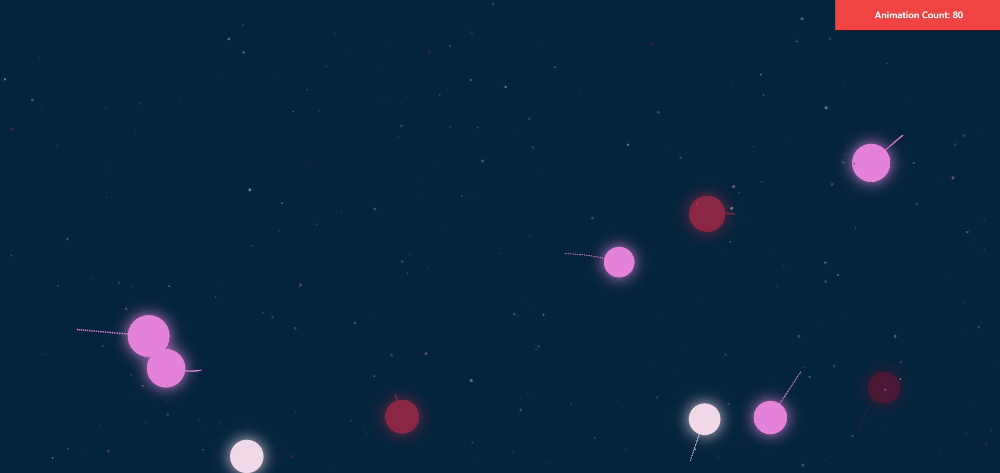

# Bouncing Balls

HTML5 Canvas + React Project. Balls with random radius & color spawn randomly on the screen. The balls move in a random direction and has collision with the canvas frame and with each other. This project is created for my WA22 SF1 Assignment. Click to add more balls!

https://bouncing-balls.riaanjlagrange.com

## Run Locally

Clone the project

```bash
  git clone https://github.com/riaanjlagrange/bouncing_balls
```

Go to the project directory

```bash
  cd bouncing_balls
```

Install dependencies

```bash
  npm install
```

Start the server

```bash
  npm run dev
```

## Tech Stack

**Client:** React, TailwindCSS

## Screenshots


